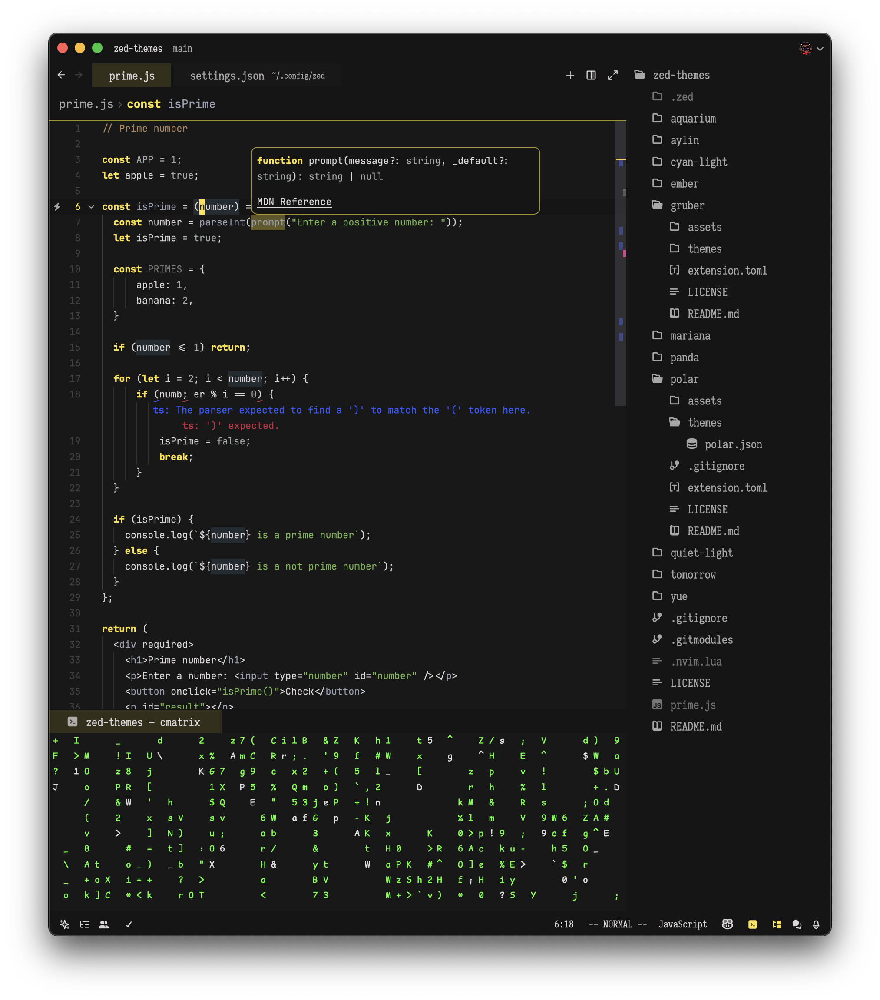

# Gruber
Flavors of a theme for recreational programmers heavily inspired by [Gruber](https://github.com/rexim/gruber-darker-theme).

## Preview
### Banana

## Installation
1. Copy gruber.json to ~/.config/zed/themes/
2. Open Zed and navigate to Settings -> Theme -> Gruber Soda
